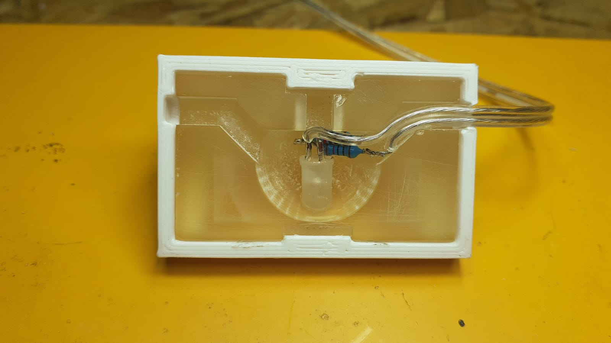
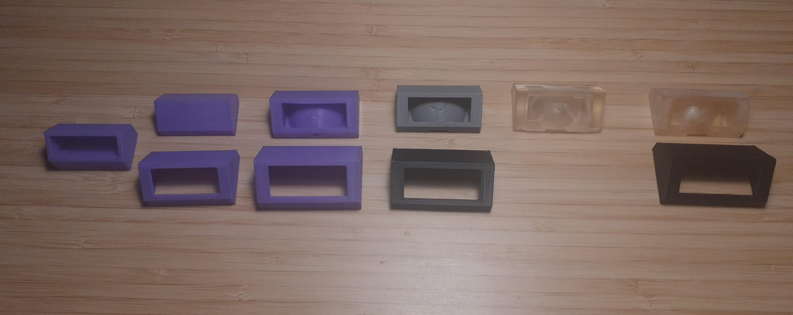
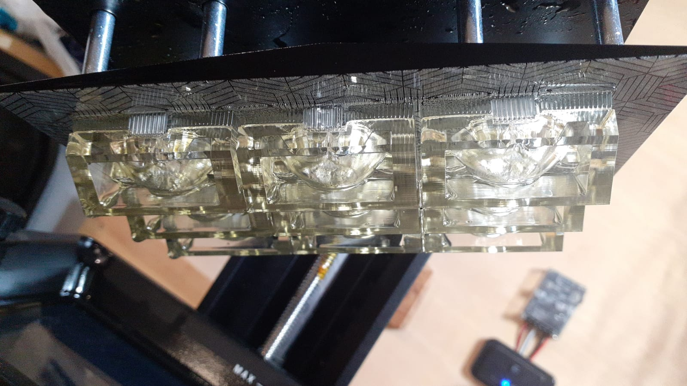
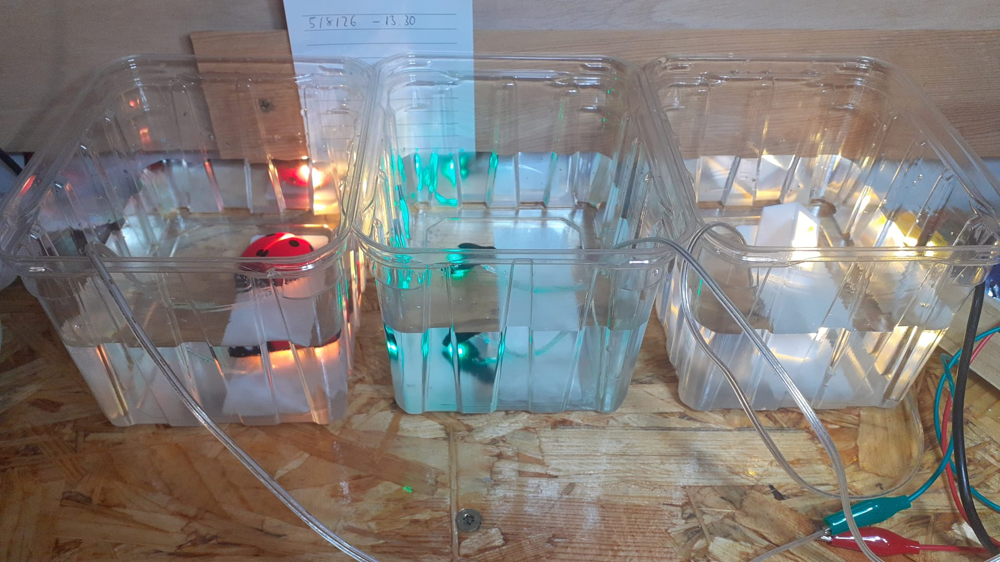

# Vertical Sconces

<!---->

Este diseño se aleja en estética de los demás, pero no en función ni filosofía. El objetivo es iluminar los escalones de una escalera, limitando la luz que se desperdicia hacia arriba o hacia delante.

Cada aplique se coloca en la contrahuella del escalón, inmediatamente debajo del voladizo, iluminando así la huella contigiua. 

## Diseño

El diseño de este aplique se basa en las recomendaciones de [DarkSky](https://darksky.org/) sobre las buenas prácticas de iluminación. Los cinco principios de la iluminación exterior responsable son los siguientes:

1. Usefull: utilizar luz solo si es necesario
2. Targeted: dirigir la luz para que incida solo donde es necesario
3. Low level: la luz no debe ser más brillante de lo necesario
4. Controlled: utilizar la luz solo cuando sea necesario
5. Warm-colored: utilizar colores cálidos cuando sea posible

En este caso concreto, los cinci principios se cumplen a rajatabla: la luz es necesaria por ser una zona de paso, solamente incide en el siguiente escalón, utiliza un nivel de brillo mínimo, la iluminación máxima solo se alcanza al detectarse presencia y la luz es de un blanco cálido (2700 K).

Un solo LED de 5 mm, cuya corriente está limitada por dos resistencias en serie de 220Ω, es alimentado a 12Vcc. La forma del cuerpo del aplique difumina y dirige la luz hacia abajo, mientras que la carcasa restringe el flujo luminoso hacia arriba. 

La geometría del cuerpo está diseñada para albergar el led y las resistencias, así como el cable de alimentación. Todo este volumen puede ser rellenado posteriormente con resina epoxi. El cable puede ser guiado por uno de los canales de los lados o puede salir perpendicularmente hacia atrás. Para la fijación, puede instalarse un tornillo M8 en el espacio junto al LED, o pegarse con silicona o algún equivalente directamente a la superficie.

El ahuecado destinado al LED está contenido a ambos lados por dos paredes temporales de 1 mm de espesor. En caso de ser necesario, una de ellas puede romperse para pasar el cable, mientras que la otra epita que la resina epoxi se vierta hacia fuera.

La carcasa encaja directamente sobre el cuerpo mediante dos pestañas. Tiene, además, una depresión a cada lado. Esta depresión puede romperse para pasar el cable por donde sea necesario, según el caso. 

El diseño final fue obtenido mediante un proceso iterativo, reflejado en la carpeta [development](development), así como en la siguiente imagen:

Un Arduino Nano, mediante un módulo MOSFET, es el encargado de regular el nivel de brillo de las luminarias. Al romperse una de las barreras fotoeléctricas en el inicio y el final de la escalera, el brillo de las luminarias aumenta hasta su nivel máximo durante un tiempo determinado. El [programa](firmware/control_apliques/) para este comportamiento se encuentra en la carpeta de firmware.

## Fabricación

Todos los cuerpos están impresos en resina mediante una impresora MSLA. Es cuestionable si la resina aguantará adecuandamente el exterior, pero sus propiedades ópticas no pueden ser conseguidas con otros medios de fabricación a mi alcance.

Las carcasas están impresas en PETG, en este caso de color blanco, aunque no hay ninguna restricción. De hecho, colores más oscuros limitan la cantidad de luz que puede filtrarse hacia arriba.Más detalles de la impresión están disponibles en [Printables](todavía_no_está_subido)

El LED del interior se suelda en serien con las dos resistencias (o con cualquier otra combinación equivalente), y después se pega temporalmente con cianoacrilato en la hendidura del cuerpo. Las resistencias deben quedar en el interior del cuerpo para el expoxi posterior. Tras esto, se rompe la pared del canal correspondiente y se pega también el inicio del cable.

Utilizando espuma floral para mantener fija la superficie de trabajo, se puede proceder a rellenar con resina el alojamiento del LED. Una vez curada, se puede romper la pared correspondiente de la cubierta, y el cable ya es libre de pasar una vez se encajen las dos piezas.

## Instalación y pruebas

Al igual que otros diseños de este repositorio (véase [mariquitas](/mariquitas) y [luciérnagas](/luciernagas)), tras la fabricación varias muestras fueron sometidas a varias horas sumergidas.

La prueba consistió en mantener los prototipos completamente sumergidos en agua durante 72 horas. Además, durante toda la prueba las luces quedaron alimentadas y funcionando. Transcurrido el tiepo, se comprobó que efectivamente no había daños causados por la penetración de agua. Además, todos los dispositivos mantuvieron consumos estables durante y después de la prueba. 

Esta prueba no es comparable a una certificación IP, ni representa adecuadamente el envejecimiento a la intemperie. Sin embargo, sí es un indicativo de que soportará la lluvia sin problemas.

