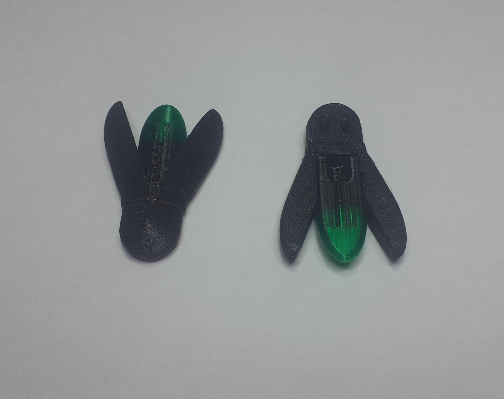
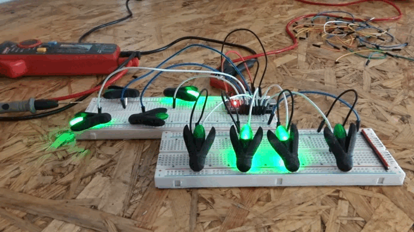
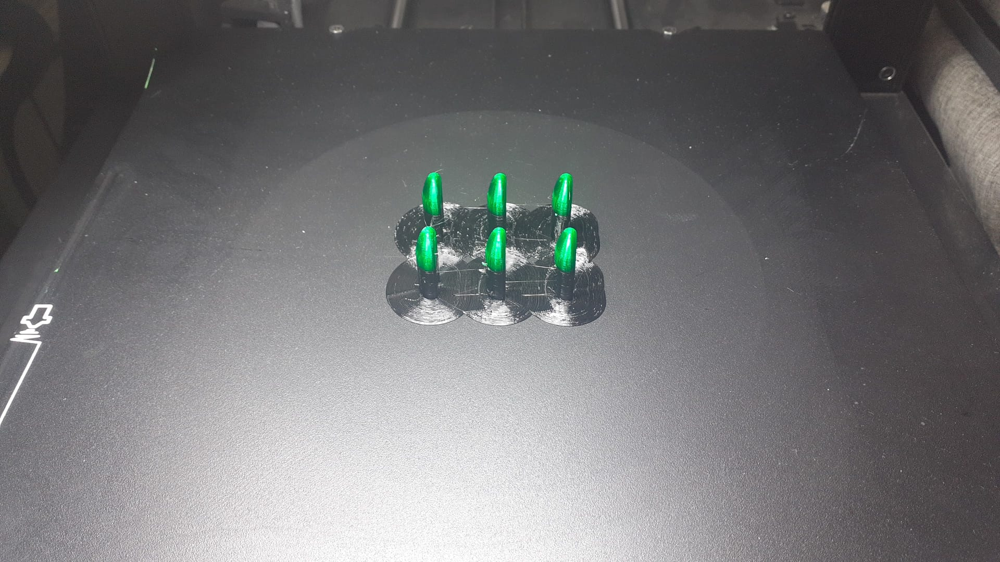
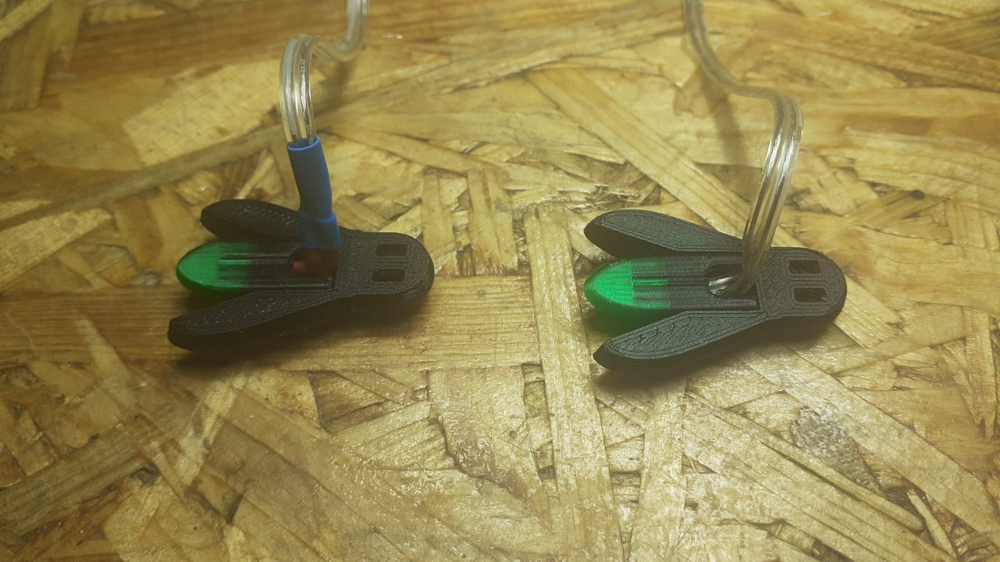
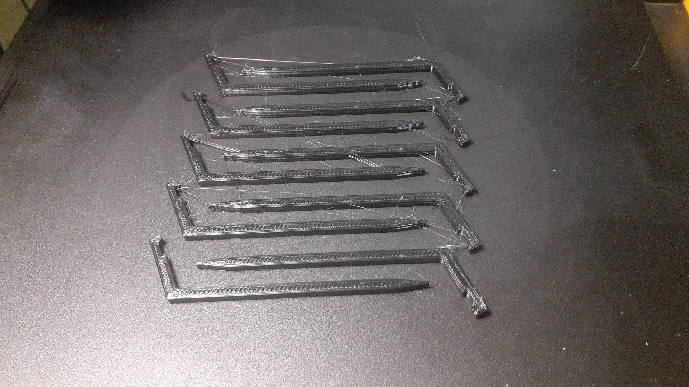

# Firefly garden lights

<!---->

Este proyecto consiste en pequeñas luciérnagas decorativas impresas en 3D, diseñadas para crear una iluminación ambiental sutil en jardines sin generar una luz intensa. A diferencia de la iluminación exterior convencional, este proyecto busca preservar la oscuridad del entorno añadiendo pequeños puntos de luz animados inspirados en las luciérnagas reales.

Continuando con la filosofía de iluminar con una estética natural y no intrusiva, este diseño añade una nueva característica al jardín: dinamismo. No solamente son luces para decorar, sino que, al simular ser luciérnagas, dan movimiento y vida a un elemento que, normalmente, es totalmente estático.

## Diseño

Los puntos de luz no buscan tanto el parecerse al insecto real (no es precisamente estético), sino ser un bicho genérico por el día, que cobra vida suplantando a una luciérnaga por la noche. La idea es que la fuente de luz sea apenas visible, de tal manera que la luz parece salir del propio elemento (muro, planta, barandilla...). El comportamiento real de las luciérnagas también es relevante para el programa, lo cual se detallará más adelante.

El diseño mecánico consta de dos piezas (cuerpo y culo) que encajan entre sí. El siguiente [documento](docs/esquemas_luciernagas.pdf) muestra las características del diseño. Las dos piezas están impresas en PETG color negro, a excepción del extremo del culo, que cambia a filamento de PETG esta vez verde traslúcido. De esta manera, el LED (que se aloja en el interior del culo) desprende su luz solamente por la parte baja del abdomen del animal, igual que las luciérnagas reales.

En cuanto al controlador, éste es un simple Arduino Nano, con un máximo de 10 luciérnagas. El máximo viene dado por la intensidad máxima admisible del controlador (200mA). En cualquier caso, dado que no todas las luciérnagas permanecen encendidas constantemente, es posible empujar este máximo hasta los 13 pines que tiene Arduino Nano. El programa tiene por objetivo encender y apagar individualmente las luciérnagas de forma pseudoaleatoria.

Para lograr el efecto, cada luciérnaga se conecta a uno de los GPIO del Nano. La mitad de los pines tienen capacidad de control PWM, por lo que las luciérnagas conectadas a estos tienen un comportamiento más detallado. Al igual que las luciérnagas reales, están mayoritariamente apagadas, con breves destellos de luz. Estos destellos se dan en tiempos aleatorios, con duraciones aleatorias, y con brillos máximos y pendientes de encendido y apagado también aleatorias. Además, tienen una pequeña probabilidad de encenderse de nuevo instantáneamente, dando el efecto visual de que hace un «amago» de apagarse. El comportamiento de las luciérnagas es mucho más detallado, y reciben el nombre de *luciernagas analogicas* dentro del programa.

Las luciérnagas conectadas a pines sin control PWM (las *luciérnagas digitales*) tienen un comportamiento más simple. Están mayoritariamente encendidas, con pequeños intervalos aleatorios en los que se apagan. Es un efecto mucho menos natural, pero que coincide mejor con el imaginario popular. La bioluminiscencia de las luciérnagas tiene por objetivo la reproducción, con destellos breves y brillantes. Son embargo, ha calado en la cultura popular la imagen de un insecto que permanece brillando constantemente. No es correcto desde el punto de vista de la entomología, pero a fin de respetar esta idea y, de paso, mejorar la iluminación, la mitad de las luciérnagas serán digitales.

El código está parcialmente escrito con el agente de IA Chat-GPT, con mucho esfuerzo por conseguir un código claro y fácil de entender. Es por eso que en la carpeta de [development](development) hay dos versiones antiguas del código. En cualquier caso, la [versión final del programa](firmware/luciernagas_v3/luciernagas_v3.ino) es de autoría completamente humana. 

## Fabricación

Como la mayoría de elementos de este repositorio, las luciérnagas están impresas en FDM. Es posible consultar las instrucciones de impresión en [Printables](https://www.printables.com/model/1780548-firefly-garden-lights). En caso de utilizar una impresora con una sola boquilla y sin sistema automático de cambio de filamente, es estrictamente necesario programar una pausa y cambiar el filamento de forma manual para la impresión de los culos. No se alcanzaría un nivel de calidad y robustez equivalente si el modelo se separase en más piezas para acomodar los distintos filamentos. El cambio debe producirse aproximadamente a 2/3 de la altura total (aunque es cierto que la capa exacta no es especialmente relevante, es importante que el final del espacio interno no se imprima en filamento negro).

El LED que irá montado en el interior es un diodo de 3 mm y color verde. Se exploró la idea de proteger las soldaduras con tubo termorretráctil, pero es una idea que quedó descartada por el mal resultado estético.

Así, simplemente es necesario soldar las dos patas del LED a un cable adecuado, y después insertar el conjunto hasta el fondo de la pieza. El cuerpo de desliza en posición, y la unión puede reforzarse temporalmente con adhesivo de cianoacrilato. Para mejorar la resistencia al agua, el culo es rellenado con resina epoxi, tras lo cual la luminaria está terminada y lista para instalar.

## Montaje e instalación

Las luciérnagas cuentan en la cabeza con un espacio para una brida, así que es muy sencillo fijarlas a enrejados verticales. Cada luciérnaga está individualmente conectada a un pin de arduino con un cordón independiente. Es deseable esconder el cable pasándolo por detrás de la cabeza y embridándolo junto con la propia luciérnaga, dándole además un ángulo a toda la pieza. 

Para instalar luciérnagas en el suelo, están disponibles para imprimir las siguientes [picas](models/picas.stl), con espacio para una luciérnaga sujeta con una brida.

## Resultado

Por el momento la instalación está sin terminar, por lo que el resultado no está disponible
