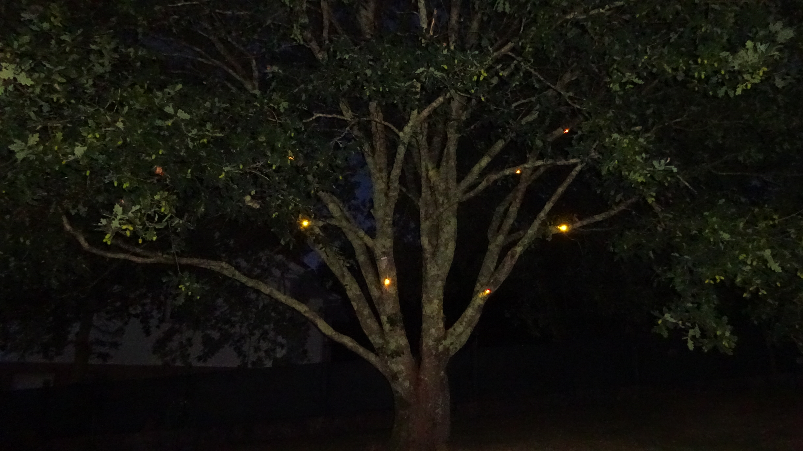
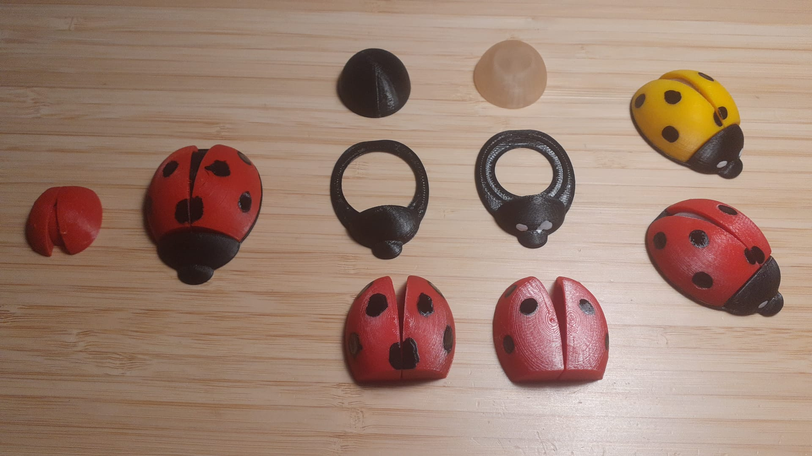
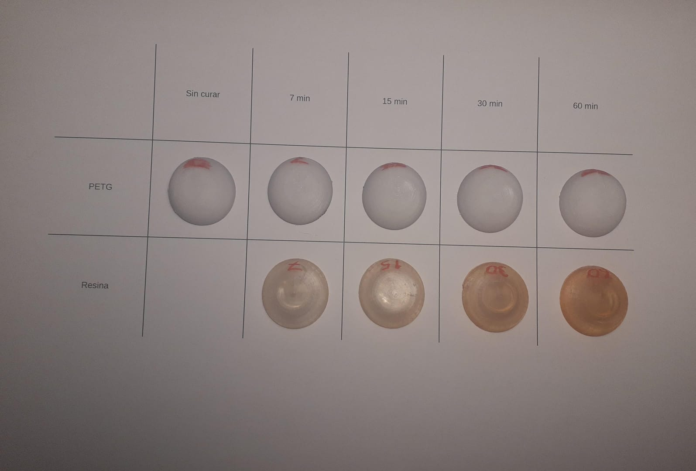
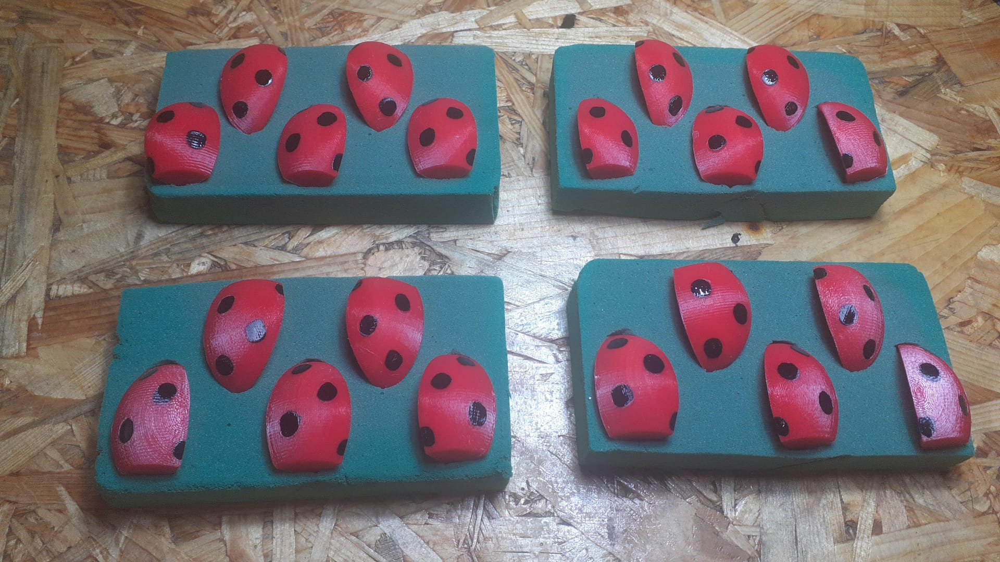
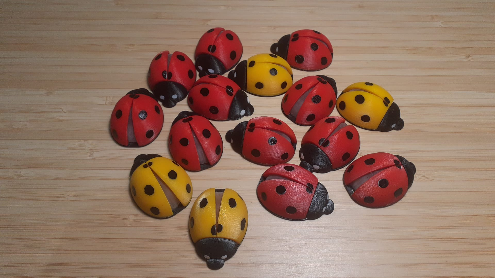
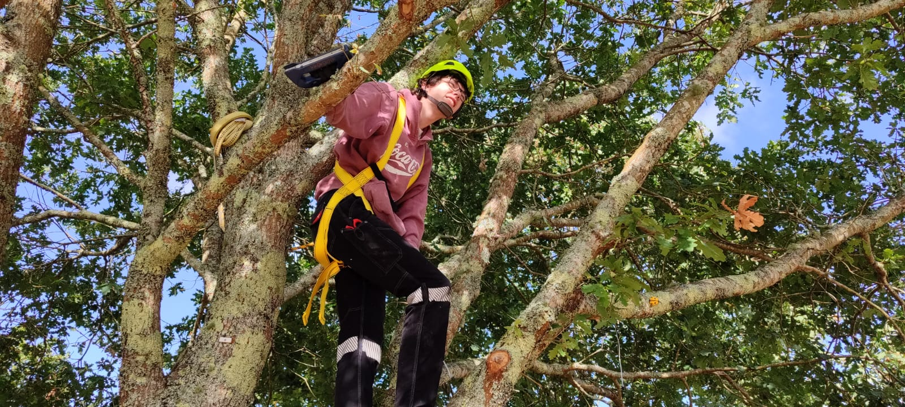

# Ladybug decoration

Sistema de iluminación decorativa para exterior compuesto por mariquitas impresas en 3D e instaladas sobre un roble. Cada mariquita incorpora un LED y forma parte de un sistema controlado por Arduino y activado mediante un sensor PIR.

El objetivo era crear una iluminación integrada en el árbol, discreta durante el día y visible únicamente como pequeños puntos luminosos entre las ramas al anochecer.

## Diseño

Los puntos de luz buscan asemejarse a la simplificación de una mariquita, manteniendo, eso sí, las partes más importantes. Por lo tanto, el diseño de la mariquita se divide en dos élitros (que son la misma pieza reflejada), un abdomen transparente y un cuerpo negro que incluye la cabeza y el pronoto. 

La mariquita escogida para imitar es la especie *Coccinella septempunctata*, tratándose de la más habitual en España. Es de color rojo brillante, con exactamente siete puntos negros repartidos entre los dos élitros, y dos puntos blancos en el pronoto. La especie *Psyllobora vigintiduopunctata* también es relativamente habitual en Galicia, pero, para evitar complicaciones, se simplifican las diferencias entre ambas simplemente cambiando el color de los élitros, pero manteniendo el mismo número de puntos. Nótese que la mariquita amarilla debería tener, en realidad, 22 puntos entre ambos élitros, así como 5 más en el pronoto y la cabeza, que también son de color amarillo. 

Las mariquitas estarán controladas individualmente por un Arduino Nano, según el siguiente [programa](firmware/mariquitas_v1/mariquitas_v1.ino). 3 o 4 mariquitas son seleccionadas al azar para permanecer encendidas permanentemente al inicio del programa. Las demás alternarán entre encendido y apagado si se detecta movimiento, volviendo a apagarse transcurrido un tiempo programado. 

El controlador, así como el sensor de movimiento, están ubicados en el árbol para simplificar el cableado (y, en el caso del sensor, para permitir su correcto funcionamiento). Para evitar que estos elementos desentonen con el resto del medio, estarán montados en el interior de dos cajas de conexiones impresas con la forma de dos hongos xilófagos. [Uno de ellos](models/soporte_nano.stl) alojará el controlador y [el otro](models/soporte_pir.stl) el sensor PIR. Ambos modelos son remix del siguiente [modelo original de printables](https://www.printables.com/model/681191-mushroom-shelves-with-sturdy-wall-mount-fungus-she), de moWerk. 

Estos dos elementos estarán atornillados al tronco del árbol utilizando el mismo [anclaje](models/soporte_pared.stl), con un tornillo de acero inoxidable. El resto de fijaciones al árbol, en la medida de lo posible, se realizarán mediante una cuerda utilizando un [doble nudo corredizo](images/doble_nudo_corredizo.jpg). De esta forma, a medida que las ramas crezcan en diámetro, el cordel no produce el estrangulamiento de las mismas, que puede ser muy perjudicial para la planta. 

Un [esquema](docs/esquema_electrico_mariquitas.pdf) muestra cómo se conecta el controlador a la instalación eléctrica preexistente.

<!-- El esquema eléctrico en la carpeta de documentos, por si cabía alguna duda, es una broma. Si has llegado a ver este mensaje, felicidades. Si ya te imaginabas que era broma, de nuevo te felicito. Para aquellas personas que se lo creyeron de verdad, lo siento, pero hay que tener un poco más de pensamiento crítico -->

El diseño estructural atravesó varias etapas hasta la geometría final (como se muestra en la siguiente imagen).

Para todas las piezas se utiliza PETG, de colores negro y rojo o amarillo y rojo, a excepción del abdómen, para el cual es más adecuada la impresión mediante MSLA. Las impresoras MSLA utilizan resinas fotosensibles como materia prima, y una pantalla ultravioleta para solidificar las capas. Por este motivo, las líneas de impresión y las capas son mucho más pequeñas, obteniendo una precisión mucho mayor. Utilizando una resina transparente, la pieza impresa es mucho más próxima al resultado deseado que utilizando FDM. Además, los tiempos de impresión también se reducen considerablemente.

Por otro lado, las resinas fotosensibles, y a diferencia del PETG, tienden a amarillear con el tiempo. El amarilleo fue ensayado utilizando una cámara de curado ultravioleta, tras lo cual se perciben los siguientes resultados:

El PETG, a pesar de ser traslúcido, pasa a un color blanquecino al imprimirse, y la luz que lo atraviesa pierde mucha intensidad. La resina, sin embargo, es fundamentalmente transparente, y tiende al naranja con la exposición prolongada. Pese a que, en general, es un efecto indeseado, en este caso, el color que adquiere es relativamente parecido al de las alas de una mariquita real, por lo que resulta preferible la resina por sus propiedades ópticas, a pesar de su envejecimiento prematuro.

## Fabricación

La mayoría de las piezas se imprimen en una impresora FDM convencional, con altura de capa 0,12 mm y boquilla de 0,4 mm. Se utiliza filamento de PETG rojo o amarillo para los élitros, y filamento negro para el cuerpo. Los abdómenes están impresos en una impresora de resina con resina estándar traslúcida. Las piezas impresas están postprocesadas mediante lavado con isopropanol y curado en cámara UV.Están disponibles más instrucciones de impresión en [Printables](https://www.printables.com/model/1791994-ladybug-decoration)

Los puntos de los élitros están marcados en el propio modelo mediante pequeñas hendiduras en la superfice. Cada élitro cuenta con 3 puntos y medio. Estos puntos están pintados con esmalte de uñas convencional. Es una pintura extraordinariamente resistente y mucho más económina que otras soluciones semejantes. Para el proceso de pintado se utiliza un trozo de espuma floral, que sujetará las piezas en el plano de trabajo. Con un cuentagotas se pueden depositar pequeñas cantidades de esmalte en donde sea necesario, y, con la ayuda de la tensión superficial y la depresion en la pieza, el círculo que se forma es casi perfecto. 

El proceso para pintar los puntos blancos en los pronotos es el mismo. 

Con todas las piezas pintadas y preparadas, es posible montar las mariquitas. El abdomen encaja en el cuerpo a presión, reforzando la unión con adhesivo de cianoacrilato. Los élitros encajan a presión entre el abdomen y el cuerpo, reforzando de nuevo la unión con cianoacrilato. Con esto, la fabricación mecánica queda completada

La iluminación en cada mariquita viene dada por un único led de color blanco cálido (2700 K) de 5 mm. Éste led se suelda a un conductor adecuado y se pega provisionalmente en el espacio destinado a tal uso en el interior del abdomen. Aprovechando ahora los mismos trozos de espuma floral que para pintar, las mariquitas se pueden colocar del revés para rellenar el abdomen con resina epoxi, asegurando así la impermeabilidad. 

## Pruebas e instalación

Para asegurar el correcto funcionamiento en condiciones climáticas adversas, las mariquitas pasaron 72 horas sumergidas y conectadas. Una vez que superaron esta prueba, pudo procederse con la instalación. Cada mariquita tiene su propio cable, por lo que es importante gestionarlos correctamente para evitar fallos de conexión. Solamente falta subir y colocar cada mariquita individualmente, así como el controlador y el sensor de movimiento. La técnica del doble nudo corredizo fue utilizada en la medida de lo posible, pero en las zonas en las que el diámetro era demasiado grande o el cordel quedaba demasiado a la vista se utilizaron grapas. 

Pese a que los cables sean muy visibles inmediatamente tras la instalación, en Galicia, y tratándose de un roble, se espera que, a lo sumo, en el plazo de dos años, la mayoría de los elementos queden completamente cubiertos de una capa de musgo y líquen. Además, es un sistema de fijación natural mejor incluso que las grapas. En cualquier caso, los conductores deberán situarse siempre en las partes menos visibles del árbol, como por encima de las ramas o por detrás del tronco (suponiendo que el observador está en una posición conocida). 

Como es lógico, y al tratarse de un trabajo en altura, todos los EPIs debe ser utilizados (guantes, casco y arnés).

