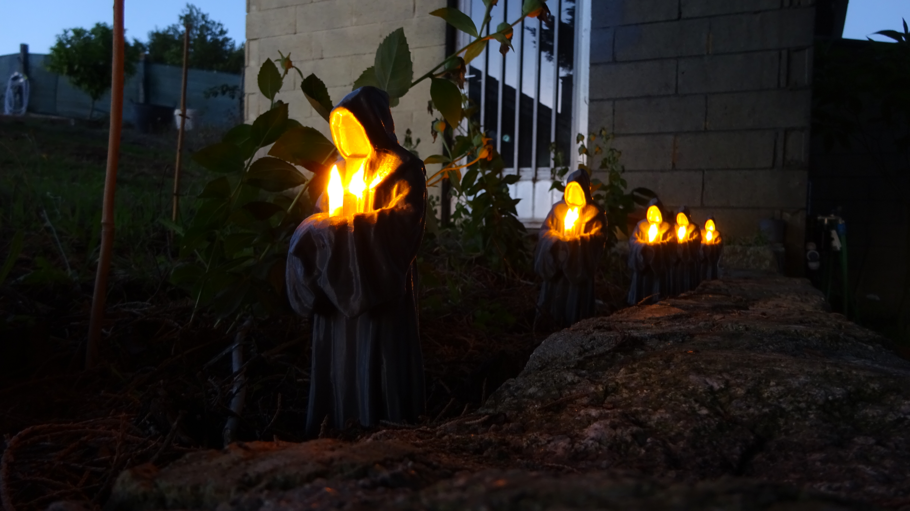
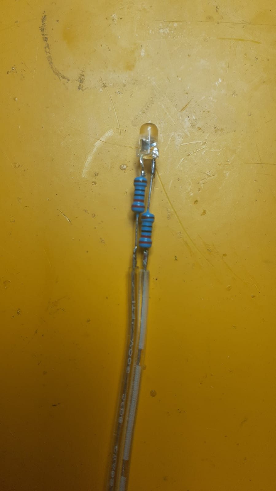
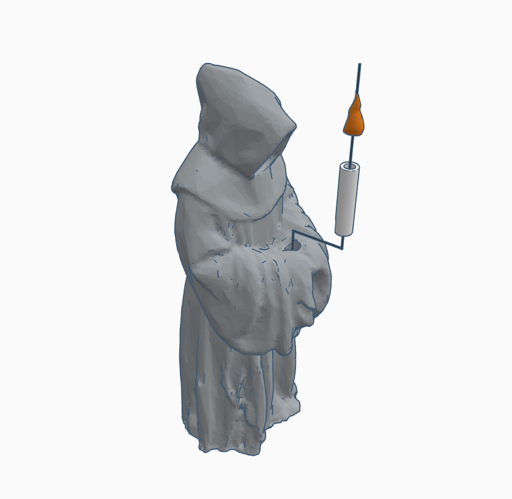

# Santa Compaña

Contan as lendas que ás doce da noite, todas as noites, os defuntos se levantan e saen do Purgatorio en procesión. Unha persoa viva, carrexando unha cruz e un caldeiro con auga bendita, encabeza a comitiva e baixo ningunha circunstancia se pode voltear. Cada defunto leva unha candea que non se ve, pero da que si se pode porcibir o seu recendo. Tampouco a procesión é visible, pero si se nota a airexa que produce. O desgraciado que lidera esta Compaña só pode escapar do seu cometido atopando a outra persoa e pasándolle a cruz e o caldeiro. 

La leyenda de la [Santa Compaña](https://blog.galiciamaxica.eu/la-santa-compana/) es de las más conocidas de Galicia, por lo que, para enaltecer mi tierra, este diseño representa las almas en pena de esta historia. El objetivo es marcar un sendero, un recorrido o, en mi caso concreto, un muro de piedra. Lógicamente, es una iluminación adecuada para marcar elementos lineales.

## Diseño

La leyenda original menciona que las velas de la comitiva no son visibles, pero en este caso se obviará este detalle (principalmente para que el diseño de iluminación cumpla su objetivo de iluminar). Así, cada figura lleva consigo una pequeña vela LED que ilumina la túnica y parte de los alrededores. 

El diseño del espectro está obtenido mediante una herramienta de IA que transforma imágenes en modelos 3d. [La imagen en cuestión](images/imagen_gemini_inspiracion.jpg) también está obtenida mediante un proceso iterativo con otra herramienta de IA. El [modelo original](development/monje_og.stl), cuya maya está ligeramente editada para mejorar el aspecto y la facilidad de impresión, está disponible en la carpeta development. A este objeto se le añaden en el interior las cavidades pertinentes para alojar las conexiones eléctricas, el cableado y la fuente de luz. También se incluyen dos agujeros ciegos con el objetivo de facilitar el anclado al terreno. El siguiente [esquema](docs/esquemas_santa_compa_a.pdf) muestra las características fundamentales de las piezas. El cuerpo del espectro está impreso en PETG gris.

La vela está formada por dos piezas independientes: la propia vela y la llama. La vela está impresa en PETG blanco. Es un pequeño cilindro hueco con un pequeño hueco para permitir el paso del cable. La llama está impresa en resina traslúcida mediante MSLA, pues es una pieza demasiado pequeña para una impresora FDM. Además, las propiedades ópticas de la resina traslúcida son mucho mejores que las del filamento traslúcido. El modelo cuenta en su interior con un hueco para alojar el LED.

> [!NOTE] 
> El modelo de la llama es una obra derivada de *Be Inspired with Dominic* en [Printables](https://www.printables.com/model/21546-candle-flame-for-vase-mode)
> El modelo original está protegido por la licencia Creative Commons [Attribution 4.0 International](https://creativecommons.org/licenses/by/4.0/). En honor al autor original, el archivo derivado en este proyecto queda protegido por la misma licencia.
> Así, quedan protegidos mediante licencia CC BY los siguientes modelos: [llama_v1](development/llama_v1.stl), [llama_v2](models/llama_v2.stl).

## Fabricación e instalación

El cuerpo y la vela están impresos en una impresora FDM con filamento de PETG, de colores gris y blanco, respectivamente. La altura de capa está configurada a 0,12 mm, con boquilla de 0,4 mm. La llama está impresa en MSLA con resina traslúcida. Las piezas impresas están postprocesadas mediante lavado con isopropanol y curado en cámara UV. 

Hay una tapa incluida en el diseño final del espectro, para cerrar el espacio destinado a las conexiones eléctricas. Esta tapa está impresa en MSLA, color gris, pero puede ser impresa también en FDM. Más instrucciones de impresión están disponibles en [Printables](https://www.printables.com/model/1809919-santa-compana).

El LED empleado es de 3 mm en color ámbar, pues es el más parecido al color de una vela real. Las luminarias estarán alimentadas a 12 V, por lo que la corriente de cada led está limitada por dos resistencias de 220 Ω, una de ellas soldada en el positivo y la otra en el negativo. Es importante que no queden a la misma altura ni se solapen, pues no entrarían en la vela. El LED, las resistencias y el conductor montados quedan como se muestra a continuación:

Ahora, la cúpula del LED se pega con adhesivo de cianoacrilato a la llama, y los demás componentes quedan escondidos en el interior del cuerpo de la vela. Toda la vela es después sellada e impermeabilizada rellenando el interior con resina epoxi. 

La vela adecuadamente montada se desliza ahora en posición, sin ser necesario sellado ni adhesivo de ningún tipo, pues el ajuste por aprieto es suficiente. El cuerpo del espectro tiene en la parte de abajo, con un ángulo de 45º hacia fuera, un agujero que permite pasar conductores del exterior. La siguiente imagen muestra una vista explosionada del conjunto:

Utilizando el método más apropiado para las conexiones eléctricas (en este caso, fichas de empalme), se unen los cables de la siguiente manera: un cable de dos hilos que proviene de la anterior luminaria, un cable de dos hilos que irá a la siguiente luminaria y el cable de dos hilos de la vela, todos ellos en paralelo (positivo con positivo, negativo con negativo). Así, se forma una especie de guirnalda, alimentando solamente el primer espectro de la comitiva (o el último, según sea el caso).

Para fijarlos al suelo, dos agujeros ciegos de 3 mm de diámetro permiten utilizar clavos, pasadores o incluso brochetas para pinchar el modelo. Cabe destacar lo siguiente:

- Se deben evitar lugares en los que se acumule agua. Las piezas sensibles a la humedad están selladas, pero el modelo completo no. No es deseable que se acumule agua en el interior de la pieza.
- La fijación será tan resistente como el elemento utilizado. Las brochetas son fáciles de conseguir y de trabajar, pero pueden pudrirse y romperse.
- La fauna puede ser un problema. Topos, ratones, musarañas y otros animales que escarban la tierra pueden mover e incluso tirar las luminarias.

## Mejoras

Las velas son elementos naturalmende dinámicos que no quedan perfectamente representados con simples LEDs. Puede ser tentador utilizan un controlador tipo Arduino Pico o similar para controlar el brillo de cada vela por separado. Sin embargo, es una decisión cara y laboriosa. Una alternativa contemplada en este proyecto es utilizar un método semejante al de las guirnaldas de navidad.

En primer lugar, los leds se conectan en antiparalelo, alternando entre la posición par e impar. Con esta configuración, al alimentar la procesión con cualquier polaridad, solamente la mitad de las velas deben encenderse. Ahora, con un solo controlador y un puente H, utilizado como driver de motores de corriente continua, es posible encender alternativamente los LEDs pares o los impares. El efecto más natural se consigue manteniendo las velas permanentemente encendidas, con pequeñas variaciones en el brillo. El siguiente [esquema](docs/esquema_electrico.pdf) muestra cómo sería la conexión del puente, el controlador y la guirnalda LED.

El efecto obtenido no es igual de realista que añadiendo un controlador por elemento, pero sigue siendo suficientemente bueno como para justificar el ahorro. Es una mejora muy significativa, que apenas requiere mayor esfuerzo. En caso de que la guirnalda ya esté montada sin la configuración de antiparalelo, lo único que hay que hacer es invertir la polaridad de la conexión de cada dos velas.