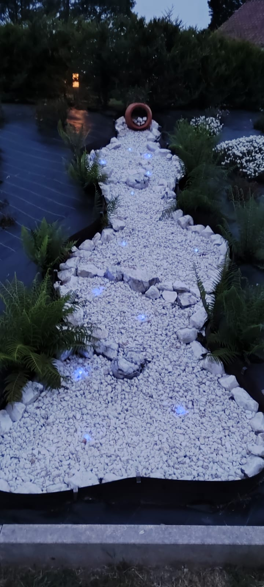
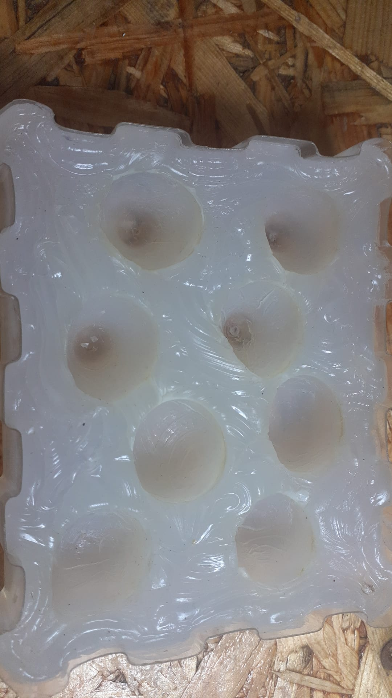
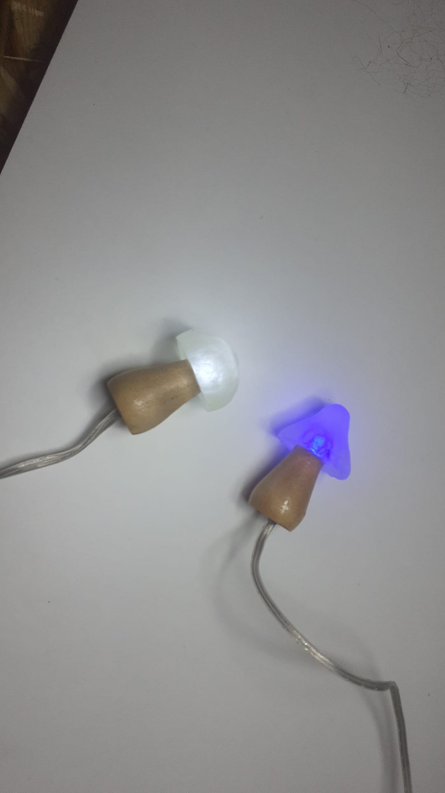
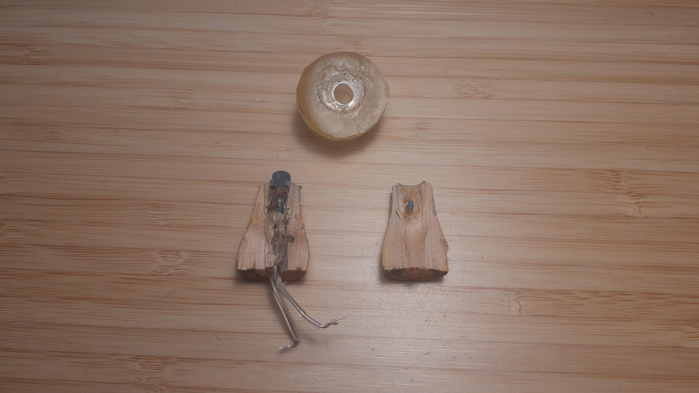
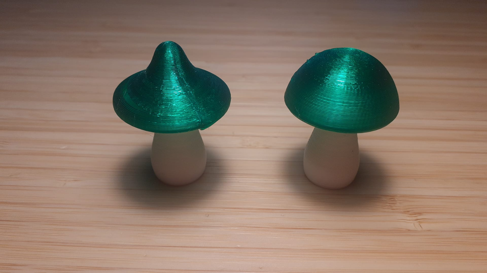

# Mushroom Garden Lights

Este proyecto surge de la necesidad de ocultar los puntos de luz utilizados para decorar un jardín. Para ello, se utiliza una seta que esconde un led en su sombrero. Cabe destacar que este proyecto no pretende iluminar un jardín. Su objetivo es ocultar las fuentes de luz para crear pequeños puntos luminosos inspirados en hongos bioluminiscentes, manteniendo la oscuridad del entorno.

> [!NOTE]
> Es un proyecto antiguo (2022), del cual se conserva el cuaderno de notas original. Puede consultarse en la carpeta de docs o [aquí](docs/setas_notas_originales.pdf).

## Fabricación

El sombrero de la seta está fabricado con resina epoxi. Será necesario elegir una resina que soporte la luz UV, pues es un diseño de exterior (las resinas convencionales amarillean con el sol). Un molde de silicona se utilizará para dar forma a la pieza en bruto de las setas, y esta debe ser cepillada (preferiblemente con un cepillo de alambre) para lograr una superficie irregular. En la parte de debajo del sombrero se realizará un agujero ciego de 5 mm de diámetro para alojar el led.

El tallo puede ser impreso, tallado o moldeado, pero es requisito imprescindible que sea completamente opaco, para evitar que se forme un halo de luz. Para los cables y el led, el tallo debe estar perforado con un agujero pasante de al menos 5 mm de diámetro, ensanchándose hasta los 6 mm en la parte superior. De esta forma cabe la base del led. 

El propio led también requiere modificaciones. Los leds convencionales tienen una cúpula en el extremo que concentra la luz en un único punto. No es el comportamiento deseable en este caso, por lo que será necesario retirar la lente de plástico y lijar el led hasta que quede completamente plano. Es un paso delicado, pues lijar o cortar demasiado conlleva destruir el diodo. Además, será necesario soldar una o dos resistencias del valor adecuado, junto al cable.

## Montaje

En primer lugar, se pega el led al sombrero con adhesivo de cianoacrilato, habiendo pasado previamente el tallo. Luego, se pega el propio tallo al sombrero. El agujero del tallo, que ahora contiene al led, debe ser rellenado de más resina epoxi para evitar que entre agua al circuito. 

## Diseño eléctrico

Cada seta contiene:
* Un led de 5 mm
* Dos resistencias de 220 Ω
* Un cable multiconductor de dos hilos

Todas las setas deben conectarse en paralelo a una fuente de alimentación de 12 V.

## Consideraciones de diseño

En cuanto al diseño, hay una serie de consideraciones que deben tenerse en cuenta:
* Es posible utilizar un sombrero totalmente translúcido con un led de color o un sombrero teñido con un led blanco. El resultado es parecido. Un ejemplo de sombrero teñido está disponible [aquí](images/sombreros_tenidos.jpg).
* Si el color del sombrero es muy oscuro, solamente con un led blanco podrá ser posible apreciar el tono.
* El resultado mejora utilizando varias setas ligeramente diferentes en forma, altura y color, evitando un aspecto repetitivo.
* Hay una tabla en la que se comparan diferentes tipos de setas en las [notas originales](docs/setas_notas_originales.pdf). Es aconsejable tenerlas en cuenta.

## Durabilidad

Las primeras 12 unidadades originales permanecieron instaladas de forma continuada en el exterior durante aproximadamente 4 años. Permanecen encendidas a lo largo de toda la noche, todas las noches, por lo que se les estima unas 17000 horas. Tras el fallo de una de ellas se realizó una inspección destructiva, siendo ésta la siguiente imagen:

No se aprecian indicios de entrada de agua, corrosión ni daños térmicos en el encapsulado. Aunque no puede determinarse con certeza la causa del fallo, la hipótesis más probable es un defecto o degradación del propio LED.

Al sustituirla por una unidad de repuesto fabricada en la misma tanda, se observa una importante disminución en el brillo de las setas ya instaladas. Esta reducción no parece deberse al LED, sino al amarilleamiento del sombrero de resina epoxi. En la imagen anterior, comparada con cualquiera de las unidades de repuesto mostradas más arriba, se aprecia muy claramente un amarilleo de la resina epoxi. La exposición prolongada a la radiación UV del sol degrada la resina y los pigmentos utilizados. Este resultado apunta a que debe utilizarse una resina adecuada para la exposición prolongada al sol, u otros materiales con mayor resistencia al envejecimiento.

## Actualización

> [!IMPORTANT]
> He incluido dos modelos 3d para el sombrero y otros dos para los pies.

Los modelos están disponibles en la carpeta [models](models), y las instrucciones de impresión pueden consultarse en [Printables](https://www.printables.com/model/1780508-mushroom-light-fixture). No son exactamente iguales a los originales; ambos sombreros son más grandes para dar un resultado más proporcional que el diseño de 2022. La imagen anterior muestra el resultado de su impresión antes de postprocesar.
